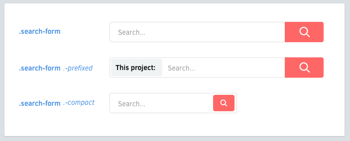

# 變形 (Variants)

每個元件及元素會有不同的變形需求來適應各種使用時機。

<!-- Components may have variants. Elements may have variants, too. -->

## 變形命名

為變形類別命名時，皆以破折號(`-`)作為前綴詞。

<!-- Classnames for variants will be prefixed by a dash (`-`). -->

~~~scss
.like-button {
	&.-wide { /* ... */ }
	&.-short { /* ... */ }
	&.-disabled { /* ... */ }
}
~~~

## 元素變形

元素變形範例。

<!-- Elements may also have variants. -->

~~~scss
.shopping-card {
	> .title { /* ... */ }
	> .title.-small { /* ... */ }
}
~~~

## 前綴詞

建議以破折號(`-`)作為變形類別的前綴詞。

<!-- Dashes are the preferred prefix for variants. -->

* 這可以避免與一般元素混淆。
* CSS 類別可以以破折號 `_` 或底線 `-` 作為字頭命名。
* 但破折號比底線好打一些。
* 這類似於 UNIX 指令 (`gcc -O2 -Wall -emit-last`)。

<!--
  * It prevents ambiguity with elements.
  * A CSS class can only start with a letter, `_` or `-`.
  * Dashes are easier to type than underscores.
  * It kind of resembles switches in UNIX commands (`gcc -O2 -Wall -emit-last`).
-->

如何處理複雜的元素架構？使用"巢狀(Nest)"結構
[Continue →](nested-components.md)

<!-- How do you deal with complex elements? Nest them. -->